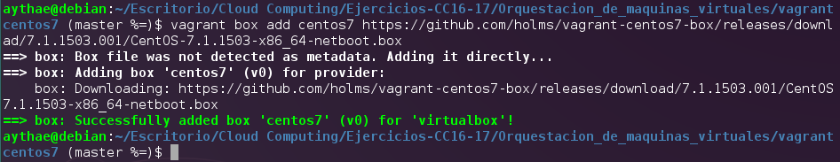
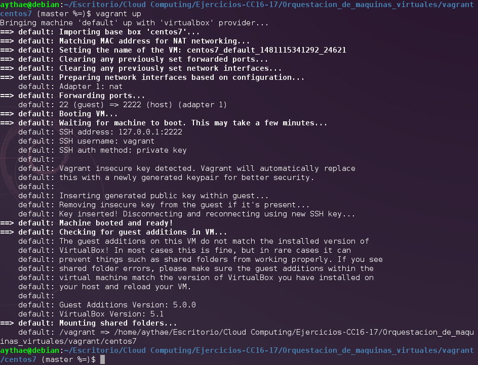
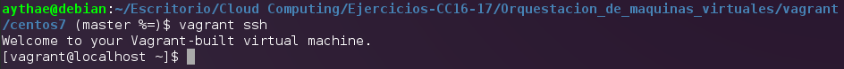
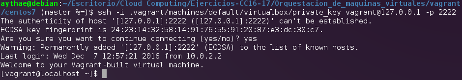

# Ejercicio 1
> Instalar una máquina virtual Debian usando Vagrant y conectar con ella.

Utilizando el [listado oficial de VM de Vagrant](http://www.vagrantbox.es/) o el [listado de Atlas](https://atlas.hashicorp.com/boxes/search) (también de Hashicorp) hay que seleccionar una imagen de una maquina virtual, en mi caso he decidido seleccionar una imagen de CentOS 7, ya que uso habitualmente Debian y me apetecía probar una distribución distinta. En la siguiente imagen se puede apreciar el proceso de instalación de la imagen del sistema operativo mediante el comando.
```
vagrant box add centos7 https://github.com/holms/vagrant-centos7-box/releases/download/7.1.1503.001/CentOS-7.1.1503-x86_64-netboot.box

```



A continuación basta con introducir el comando `vagrant init centos7` desde el directorio donde se ha realizado la instalación de la maquina virtual para crear un archivo [`Vagrantfile`](vagrant/centos7/VagrantfileEj1) utilizado por Vagrant para la configuración de la máquina virtual, tras esto es necesario ejecutar `vagrant up` para configurar la VM



tras esto ya podemos conectarnos con la VM mediante ssh con el comando `vagrant ssh` como se ve en la siguiente imagen:



o haciendo uso del cliente de ssh instalado directamente con
```
ssh -i .vagrant/machines/default/virtualbox/private_key vagrant@127.0.0.1 -p 2222
```
desde el directorio donde esté el `Vagrantfile`.




Como se ve es necesario indicarle la clave privada para la conexion ssh. He decidido utilizar la que genera vagrant en lugar utilizar una clave mía propia.
