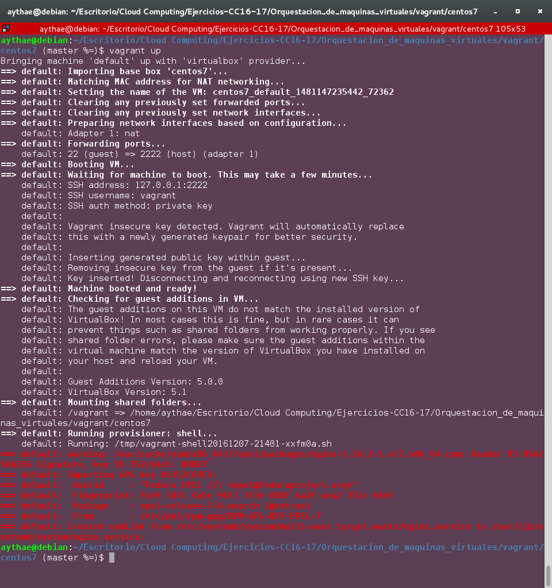
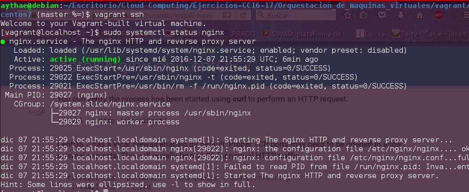

# Ejercicio 3
> Crear un script para provisionar `nginx` o cualquier otro servidor web que pueda ser útil para alguna otra práctica

He utilizado el entorno virtual de CentOS 7  configurado en el [ejercicio 1](Ejercicio1.md). He creado el siguiente siguiente script de bash para instalar nginx llamado [`nginx.sh`](vagrant/centos7/nginx.sh).

```
#!/usr/bin/env bash
#Referencia: https://www.digitalocean.com/community/tutorials/how-to-install-nginx-on-centos-7

sudo yum update -y > /dev/null

#Instalar repositorio nginx
sudo yum install epel-release -y > /dev/null

sudo yum install nginx -y > /dev/null

sudo systemctl enable nginx > /dev/null

sudo systemctl restart nginx > /dev/null

```

Es necesario modificar el `Vagrantfile` para decirle que realize un provisionamiento por shell e indicándole donde se encuentra el script `nginx.sh`, para ello hay que modificar el final de dicho fichero como se ve a continuación.
```
...
# Enable provisioning with a shell script. Additional provisioners such as
# Puppet, Chef, Ansible, Salt, and Docker are also available. Please see the
# documentation for more information about their specific syntax and use.
 config.vm.provision "shell", path: "nginx.sh"
 #SHELL
 ...
```
El fichero modificado se llama [`VagrantfileEj3`](vagrant/centos7/VagrantfileEj3). El provisionamiento se realizará al realizar un `vagrant up` para crear una VM o mediante el comando `vagrant provision` sobre una VM ya creada. En la siguiente imagen se comprueba el resultado del comando `vagrant up`.



Si accedemos a la maquina con alguno de los métodos descritos en el [ejercicio 1](Ejercicio1.md) se puede comprobar que efectivamente el servidor nginx esta instalado como servicio y activo.


