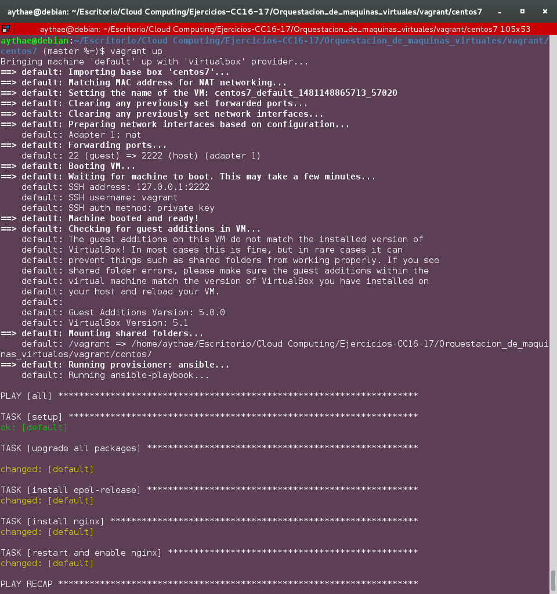
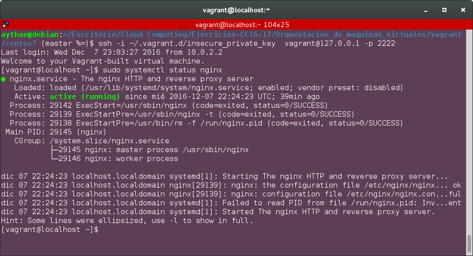

# Ejercicio 4
> Configurar tu máquina virtual usando `vagrant` con el provisionador
ansible

He utilizado el entorno virtual de CentOS 7  configurado en el [ejercicio 1](Ejercicio1.md). He creado el siguiente siguiente playbook de Ansible para instalar nginx llamado  [`playbook.yml`](vagrant/centos7/playbook.yml).

Es necesario modificar el `Vagrantfile` para decirle que realize un provisionamiento por ansible e indicándole donde se encuentra el playbook, para ello hay que modificar el final de dicho fichero siguiendo las [indicaciones oficiales de ansible](http://docs.ansible.com/ansible/guide_vagrant.html) como se ve a continuación.
```
...
config.ssh.insert_key = false

config.vm.provision "ansible" do |ansible|
#    ansible.verbose = "v"
  ansible.playbook = "playbook.yml"
end
 ...
```
El fichero modificado se llama [`VagrantfileEj4`](vagrant/centos7/VagrantfileEj4). El provisionamiento se realizará al realizar un `vagrant up` para crear una VM o mediante el comando `vagrant provision` sobre una VM ya creada. En la siguiente imagen se comprueba el resultado del comando `vagrant up`.



Si accedemos a la maquina con alguno de los métodos descritos en el [ejercicio 1](Ejercicio1.md) se puede comprobar que efectivamente el servidor nginx esta instalado como servicio y activo.


