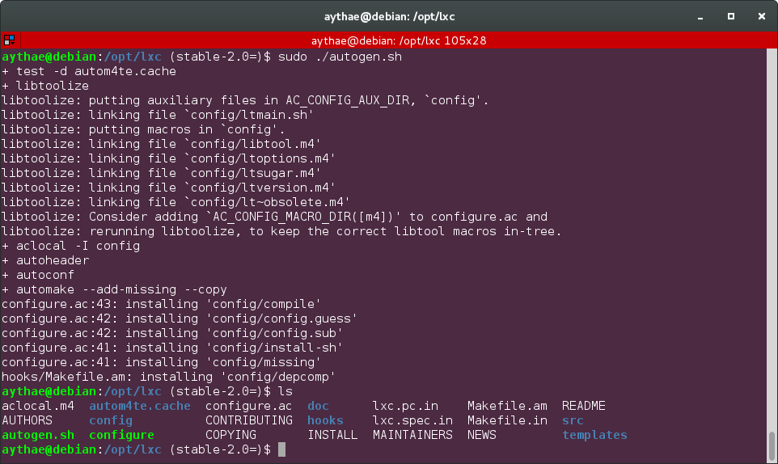
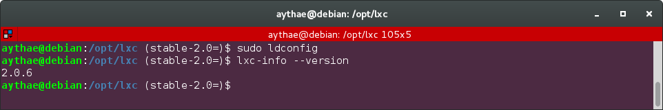

# Ejercicio 1
> Instala LXC en tu versión de Linux favorita. Normalmente la versión en desarrollo, disponible tanto en GitHub como en el sitio web está bastante más avanzada; para evitar problemas sobre todo con las herramientas que vamos a ver más adelante, conviene que te instales la última versión y si es posible una igual o mayor a la 2.0.

Voy a instalar LXC en Debian 8.6. A pesar de que es posible descargar LXC desde los repositorios oficiales de Debian la versión disponible es la 1.0.6, por lo que seguiré las [instrucciones de instalación de la versión 2.0 stable](https://github.com/lxc/lxc/tree/stable-2.0) que se ofrecen en GitHub.


Siguiendo el método simple de instalación he ejecutado `./autogen.sh` recibiendo el siguiente error:

```
$ ./autogen.sh
+ test -d autom4te.cache
+ libtoolize
./autogen.sh: 27: ./autogen.sh: libtoolize: not found
+ exit 1
```

En las instrucciones de instalación se menciona que en caso de errores hay que asegurarse de tener las siguientes dependencias instaladas así que ejecuto el comando para instalarlas

```
$ sudo apt-get install autoconf automake pkg-config make gcc
```

Tras volver a ejecutar el comando `./autogen.sh` sigue dando el mismo error. Buscando el error por internet me tope con un [issue de github](https://github.com/zeromq/libzmq/issues/1385) de una librería sin relación pero con el mismo error, en este issue se dice que es necesario instalar libtool-bin y libtool para ejecutar autogen correctamente así que ejecuto:

```
$ sudo apt-get install libtool-bin libtool
```

Con esto el error ya no aparece al ejecutar `./autogen.sh`, pero me veo obligado a ejecutarlo con permisos de super usuario por estar instalando lxc en el directorio `/opt`.



Como se puede ver todo ha ido correcto y se ha generado el fichero `configure`, tras esto ejecuto
```
$ sudo ./configure
$ sudo make
$ sudo make install
```
Si probamos a ejecutar un comando de lxc obtendremos un error del siguiente tipo

```
lxc-info: error while loading shared libraries: liblxc.so.1: cannot open shared object file: No such file or directory
```

Esto se debe a que es necesario crear links a las librerías recién creadas, eso se puede realizar con el comando
```
$ sudo ldconfig
```
Tras esto ya podemos ejecutar los comandos de lxc sin problemas.


