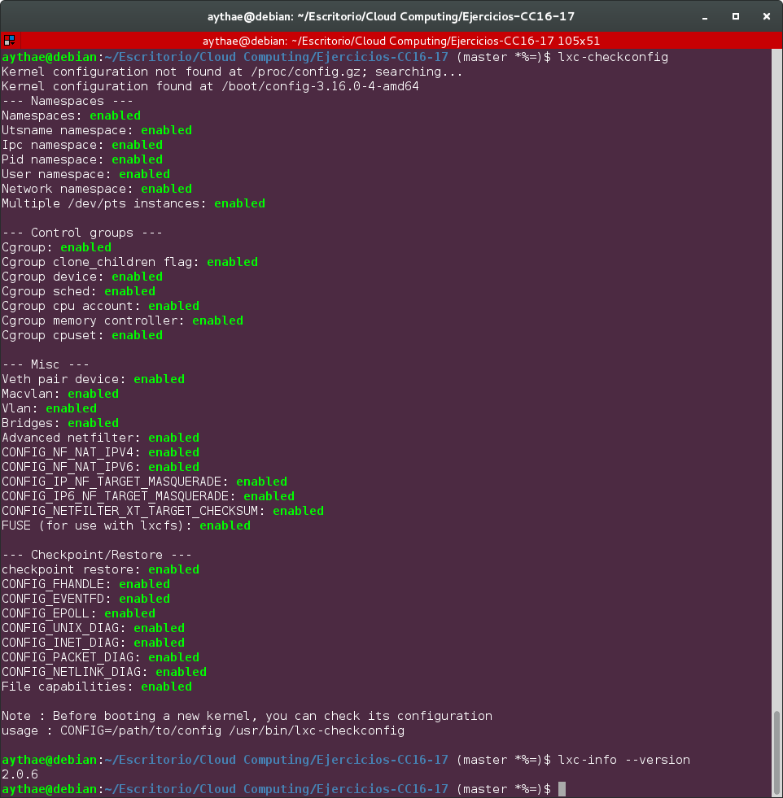

# Ejercicio 1
> Instala LXC en tu versión de Linux favorita. Normalmente la versión en desarrollo, disponible tanto en GitHub como en el sitio web está bastante más avanzada; para evitar problemas sobre todo con las herramientas que vamos a ver más adelante, conviene que te instales la última versión y si es posible una igual o mayor a la 2.0.

Voy a instalar LXC en Debian 8.6. A pesar de que es posible descargar LXC desde los repositorios oficiales de Debian la versión disponible es la 1.0.6, se puede instalar la versión 2 usando [backports](https://backports.debian.org/) un repositorio de Debian que contiene paquetes en pruebas, inestables que aun no han sido añadidos a los repositorios oficiales, por ello contiene versiones bastante más nuevas que los repositorios oficiales. Para poder añadir este repositorio vease las siguientes [instrucciones](https://backports.debian.org/Instructions/)

Una vez hecho esto podemos instalar LXC usando las [instrucciones oficiales de instalación en Debian](https://wiki.debian.org/LXC) con los comandos:
```
apt-get install -t jessie-backports  lxc libvirt0 linux-image-amd64

apt-get install libpam-cgroup libpam-cgfs bridge-utils
```

Podemos comprobar que se ha instalado correctamente ejecutando
```
lxc-checkconfig
```
Lo que nos debería de dar todo enabled, tambíen podemos comprobar la versión de lxc instalada con
```
lxc-info --version
```


