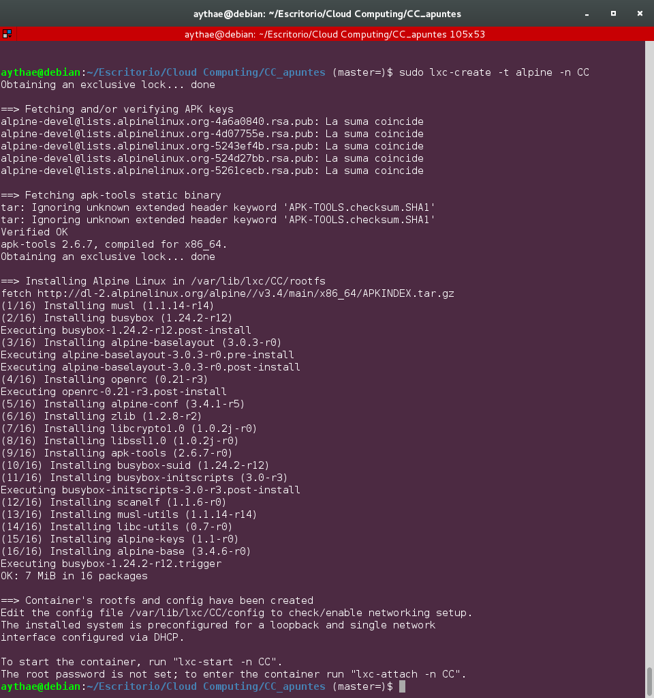
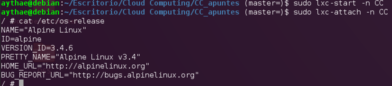

# Ejercicio 2
> Instalar una distro tal como Alpine y conectarse a ella usando el nombre de usuario y clave que indicará en su creación

Usando la versión de lxc instalada en el [ejercicio previo](Ejercicio1.md) instalaré [Alpine Linux](https://alpinelinux.org/), una distribución ligera orientada a la seguridad al uso de contenedores. Para ello basta con ejecutar el comando:

```
sudo lxc-create -t alpine -n CC
```

Donde la opción `-t` permite seleccionar alguna de las plantillas (templates en inglés) con las que cuenta lxc y la opción `-n` permite configurar el nombre del contenedor. En la siguiente imagen podemos ver la ejecución:



Ahora es necesario arrancar el contenedor recién creado con
```
sudo lxc-start -n CC
```
Tras esto ya podemos conectarnos a él con
```
sudo lxc-attach -n CC
```

