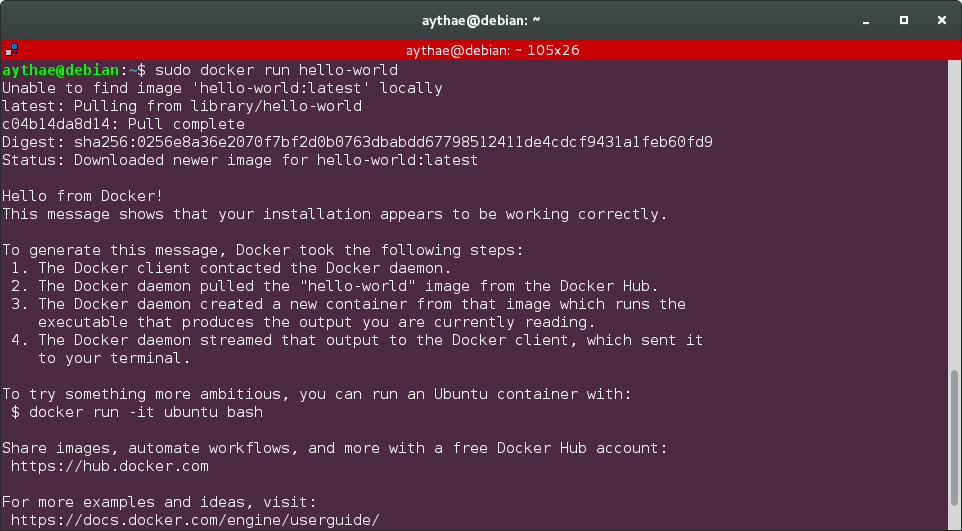
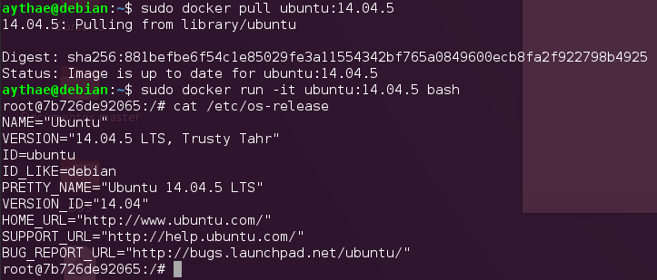
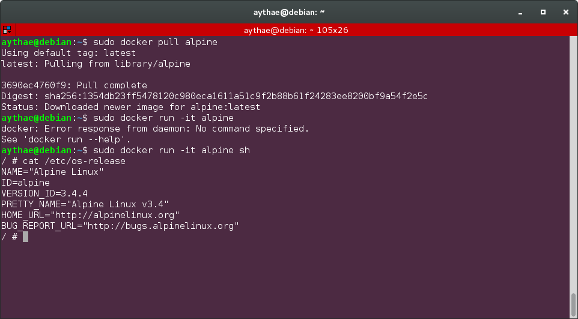

# Ejercicio 4
>Instalar una imagen alternativa de Ubuntu y alguna adicional, por ejemplo de CentOS.

Primero es necesario instalar Docker siguiendo las [instrucciones oficiales para tu SO](https://www.docker.com/products/docker/) en mi caso Debian 8.6. Tras seguir las instrucciones me tope con un problema que se puede ver en el siguiente fragmento de `/var/log/daemon.log`

```
debian systemd[1]: Listening on Docker Socket for the API.
debian systemd[1]: Starting Docker Application Container Engine...
debian dockerd[29021]: time="2016-12-26T19:46:15.691606093+01:00" level=info msg="libcontainerd: new containerd process, pid: 29027"
debian dockerd[29021]: time="2016-12-26T19:46:16.693738197+01:00" level=error msg="[graphdriver] prior storage driver \"aufs\" failed: driver not supported"
debian dockerd[29021]: time="2016-12-26T19:46:16.693788209+01:00" level=fatal msg="Error starting daemon: error initializing graphdriver: driver not supported"
debian systemd[1]: docker.service: main process exited, code=exited, status=1/FAILURE
debian systemd[1]: Failed to start Docker Application Container Engine.
```

Investigando el error encontré que es un bug de Debian en versiones del kernel 4.0+ no se soporta AUFS por lo que realice un downgrade de mi kernel a la versión stable de debian (3.16.0-4-amd64) siguiendo las siguientes [instrucciones](https://ispire.me/downgrade-from-debian-sid-to-stable-from-jessie-to-wheezy/). Una vez hecho eso y tras reiniciar el ordenador se puede ver que docker esta instalado y funcionando correctamente ejecutando

```
sudo docker run hello-world
```

Lo cuál da el siguiente resultado si todo ha ido bien:



Ahora voy a instalar un contenedor Ubuntu, en concreto un Ubuntu 14.04.5 de [DockerHub](https://hub.docker.com/_/ubuntu/). Para ello es necesario realizar un
```
sudo docker pull ubuntu:14.04.5
```

para descargar el contenedor y tras esto podemos conectarnos a él abriendo una consola bash interactiva usando

```
sudo docker run -it ubuntu:14.04.5 bash
```

En esta imágen se puede comprobar que todo ha ido bien:



Adicionalmente instalaré un contenedor Alpine y accederé a él de igual manera con los comandos

```
sudo docker pull alpine
sudo docker run -it alpine sh
```


