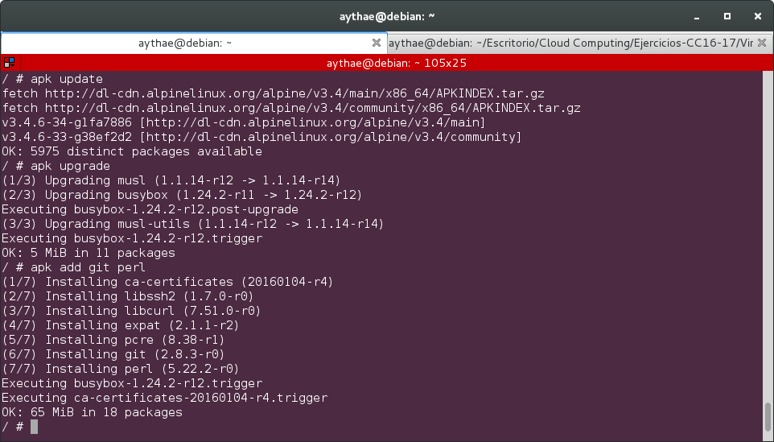
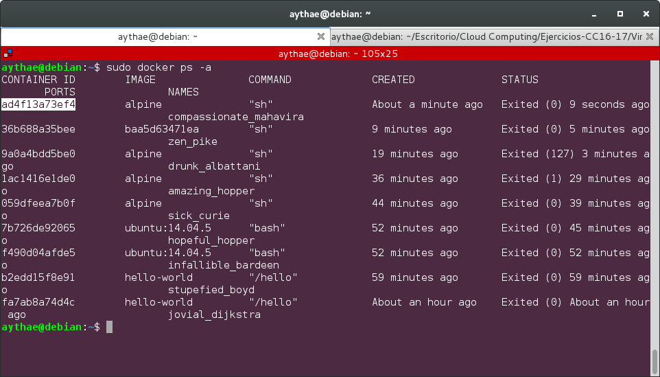
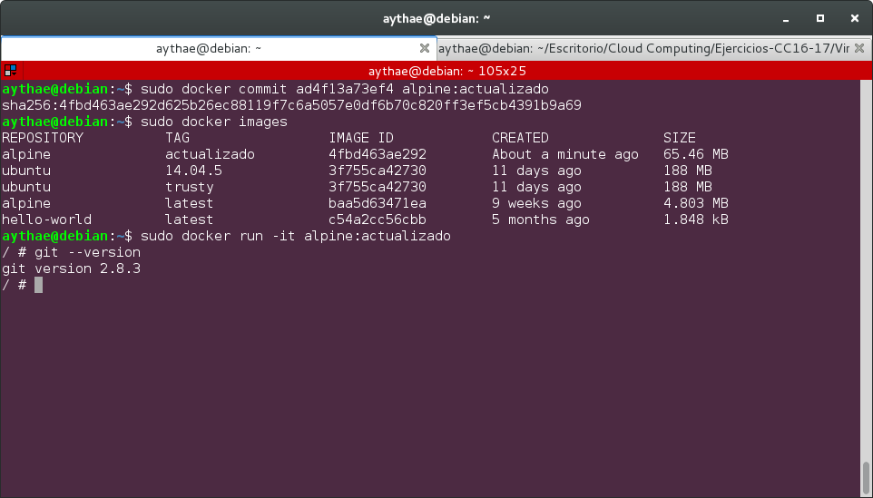

# Ejercicio 5
>Crear a partir del contenedor anterior una imagen persistente con commit.

Como contenedor inicial usare el contenedor Alpine descargado en el [ejercicio previo](Ejercicio4.md). Tras conectarme a él con el comando

```
sudo docker run -it alpine sh
```

Actualizo los paquetes existentes e instalo `git` y `perl` con los siguientes comandos

```
apk update
apk upgrade
apk add git perl
```


Una vez hecho eso salimos del container con `exit` con lo que pararemos dicho container. Para realizar un commit del estado de ese container es necesario obtener su ID de container con el comando `docker ps`, esto nos mostrará salida vacía al estar el contenedor parado, pero podemos obtener el id de contenedores parados con

```
sudo docker ps -a
```

Habrá que copiar el Container ID del ultimo container ejecutado, en mi caso el `ad4f13a73ef4` como se puede ver en esta imagen.



Para realizar un commit de ese container hay que ejecutar el comando

```
sudo docker commit ad4f13a73ef4 alpine:actualizado
```

Si ahora ejecutamos `docker images` para comprobar las imágenes creadas en el sistema vemos que aparece una nueva imagen llamada alpine:actualizado, podemos acceder a esta imágen con

```
sudo docker run -it alpine:actualizado
```

Y comprobar que tiene git instalado por ejemplo


