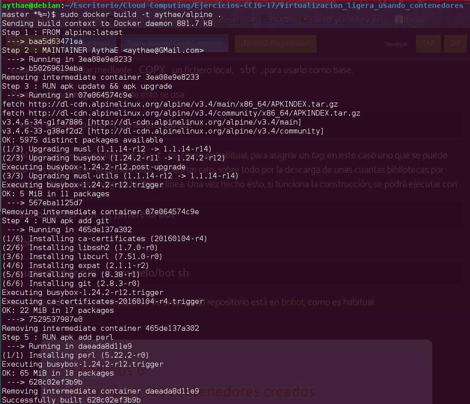
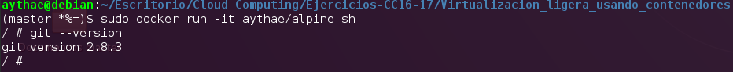

# Ejercicio 6
>Reproducir los contenedores creados anteriormente usando un Dockerfile.

Reproducire el contenedor sobre el que se ha hecho el commit en el [ejercicio previo](Ejercicio5.md) mediante el uso de Dockerfile, para ello creo el siguiente [Dockerfile](Dockerfile), ejecuto este comando para crear una imagen a partir de este Dockerfile

```
sudo docker build -t aythae/alpine .
```



Una vez creada la imagen podemos conectarnos a ella y comprobar si se han instalado los paqueres necesarios, para ello abrimos una shell interactiva de la manera usual usando este comando

```
sudo docker run -it aythae/alpine sh
```


